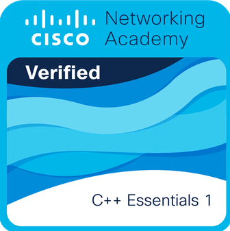

### Hola, Efrain Vitorino - Lovito99👋

## Soy un entusiasta de la tecnología, SysAdmin y Desarrollador.

- 🔭 Actualmente trabajando en agencias de viajes en Cusco en proyectos de desarrollo web y aplicaciones móviles con integraciones de pasarelas de pago Webmaster
- 🎓 Estudiando en la UNSAAC
- 🌱 Soy Estudiante de Ing. Informatica y de Sistemas,.
- � Mi primer proyecto CRM: [Whasapo][whasapo] - Desarrollado con JavaScript y TypeScript
- 😍 Amo el Open Source, este es mi primer proyecto de código abierto >> [Whasapo Dev][whasapodev]!

### Conecta conmigo:

[][facebook]
[][linkedin]
[][instagram]

 

### Lenguajes y Herramientas:

 
 

---

### Insignias:

 
 

---

### Certificaciones:

**C++ Essentials 1** - Construye tus habilidades de programación en C++ y prepárate para la certificación CPE – C++ Certified Entry-Level Programmer.

 
 

---

[website]: https://www.whasapo.com
[facebook]: https://www.facebook.com/vitorinoef
[instagram]: https://www.instagram.com/vitorinoef
[linkedin]: https://www.linkedin.com/in/vitorinoef
[whasapo]: https://github.com/whasapo
[whasapodev]: https://github.com/lovito99/whasapodev

