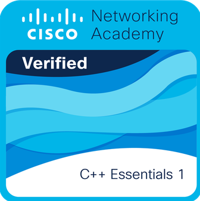
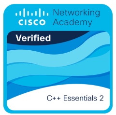
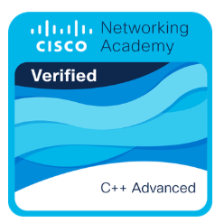

<h1 align="center">Hola, soy Efrain Vitorino Marín</h1>

  <strong>Desarrollador Full Stack · SysAdmin · Especialista en CRM, automatización y plataformas digitales</strong>

  
  
  

---

## Perfil profesional

Soy estudiante de Ingeniería Informática y de Sistemas en la UNSAAC, con experiencia práctica en desarrollo web, CRM, comercio electrónico, automatización, integración de APIs, administración de servidores VPS y despliegue de soluciones digitales para empresas turísticas, comerciales e institucionales.

Trabajo principalmente con proyectos reales orientados a reservas, atención al cliente, ventas, operaciones, pagos en línea, WhatsApp API, paneles administrativos y optimización de procesos internos.

## Áreas de especialización

- Desarrollo Full Stack con PHP, JavaScript, TypeScript, Node.js, React, Vue.js y Laravel.
- Diseño e implementación de CRM, sistemas de reservas, paneles administrativos y flujos operativos.
- Integración de APIs, webhooks, WhatsApp API, pasarelas de pago y automatizaciones.
- Administración de servidores VPS, hosting, dominios, SSL, backups, seguridad y migraciones.
- Bases de datos relacionales y NoSQL: MySQL, PostgreSQL, MongoDB y Redis.
- Cloud, despliegue y servicios: Google Cloud, AWS, Hostinger, VPS Linux, Nginx y Apache.
- Streaming, contenido digital, SEO técnico, analítica y optimización web.
- Exploración aplicada de Machine Learning, Deep Learning, modelos de aprendizaje automático y herramientas de IA.

## Stack técnico

### Lenguajes y frontend

### Backend, CMS y automatización

### Bases de datos, servidores y cloud

### IA, datos y herramientas

## Experiencia profesional

### X-Travel Peru

**Webmaster y consultor externo · 2025 - Actualidad · Cusco**

- Administración del portal, sistema de reservas, contenidos y optimización SEO.
- Migración del sitio y servicios a servidor VPS.
- Desarrollo de mejoras para operación turística, formularios, pagos y gestión comercial.
- Sitio: [xtravelperu.com](https://xtravelperu.com)

### Aventura Digital

**Webmaster y desarrollador CRM · 2020 - 2024 · Cusco**

- Desarrollo de CRM con WhatsApp API, Node.js, n8n, Typebot y webhooks.
- Automatización de atención, ventas, seguimiento de clientes e integración de APIs.
- Administración y migración de sitios web a servidores VPS.
- Sitios: [whasapo.com](https://whasapo.com) · [aventuradigital.com](https://aventuradigital.com)

### Minka Peru Travel

**Webmaster · 2022 · Cusco**

- Administración, actualización y mantenimiento del sitio web.
- Gestión de contenidos, formularios, servicios turísticos y soporte técnico.

### Katkon S.A.C.

**Diseñador y desarrollador web · 2019 - 2022 · Apurímac**

- Desarrollo de sitios web, comercio electrónico y soluciones digitales.
- Configuración de hosting, dominio, SSL, correos corporativos y respaldos.
- Sitio: [katkon.com.pe](https://katkon.com.pe)

### Municipalidad Distrital de Pisac

**Desarrollo web y soporte técnico · 2016 - 2018 · Cusco**

- Soporte técnico, mantenimiento de equipos y configuración de redes.
- Desarrollo web, gestión de bases de datos y seguridad informática.
- Sitio: [municipalidadpisac.gob.pe](https://municipalidadpisac.gob.pe)

## Proyecto destacado

### Whasapo CRM

Sistema de gestión de clientes y conversaciones integrado con WhatsApp API, webhooks y flujos automatizados mediante Node.js, n8n y Typebot.

- Gestión de contactos, conversaciones y seguimiento comercial.
- Automatización de respuestas, flujos y notificaciones.
- Integración con servicios externos mediante APIs y webhooks.
- Proyecto: [Whasapo Dev](https://github.com/lovito99/whasapodev)

## Formación

**Ingeniería Informática y de Sistemas · UNSAAC** 
2019 - Actualidad · Cusco, Perú

Formación en desarrollo de software, bases de datos, redes, sistemas de información, arquitectura de sistemas e ingeniería de software.

## Reconocimientos y certificaciones

- **Yachayninchis 2023:** segundo puesto en CORCITEC con el proyecto *Inteligencia Rural Conectada*.
- **VII Semana de Ciencia y Tecnología:** participación como expositor.
- **Cisco C++ Essentials 1, C++ Essentials 2 y C++ Advanced.**

  
  
  

Certificados:

- [C++ Essentials 1](./archivos/C--_Essentials_1_certificate_160337.pdf)
- [C++ Essentials 2](./archivos/certificado2.pdf)
- [C++ Advanced](./archivos/certificado3.pdf)

## Idiomas

- Español: nativo
- Quechua: nativo
- Inglés: A2
- Portugués: A2

## Contacto

- Cusco, Perú
- Email: [lovito99_m@live.com](mailto:lovito99_m@live.com)
- Teléfono: +51 925465788
- Sitio web: [whasapo.com](https://www.whasapo.com)
- LinkedIn: [vitorinoef](https://www.linkedin.com/in/vitorinoef)
- Instagram: [vitorinoef](https://www.instagram.com/vitorinoef)
- Facebook: [vitorinoef](https://www.facebook.com/vitorinoef)
